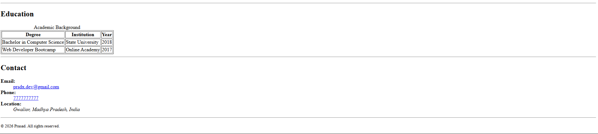

# My First Semantic HTML Resume

## 📌 Project Overview
This is my submission for the HTML assignment. My goal was to replicate the provided design while using **Semantic HTML5** to ensure the document is well-structured and easy for browsers to read.

## 🛠️ How to View the Project
1. Download the `index.html` file.
2. Double-click the file to open it in your favorite web browser (Chrome, Firefox, or Edge).

## 💡 What I Focused On (Learning Objectives)
I focused on the "Evaluation Parameters" by ensuring:
* **Structure:** I used `<header>`, `<main>`, and `<footer>` to divide the page logically.
* **Text Meaning:** I used `<strong>` for important terms and `<em>` for emphasis where needed.
* **Data Organization:** I used `<table>` for structured data (Experience/Education) and `<ul>` for lists (Skills/Projects).
* **Functionality:** I made the Email and Phone number clickable using `<a>` tags so they actually work!

## 📸 Screenshot

---
**Author:** Shubham Prasad  
**Date:** January 2026